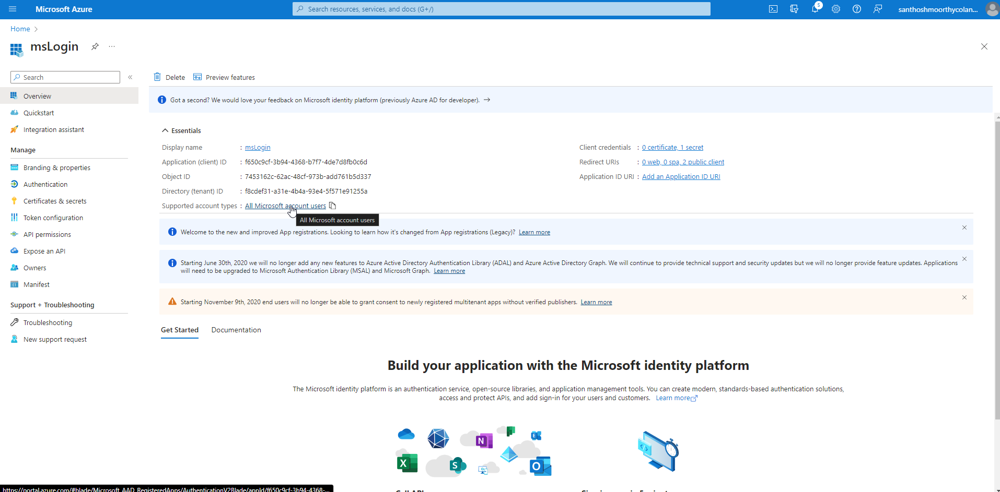
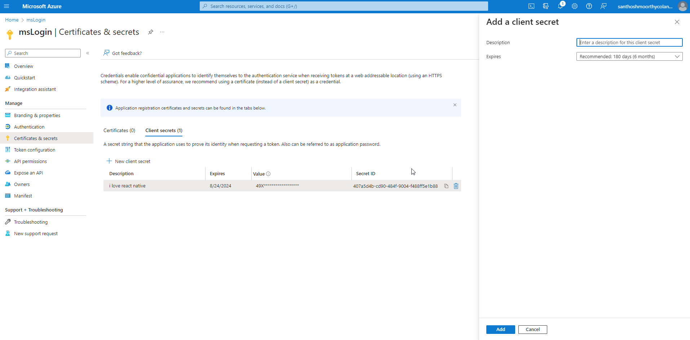
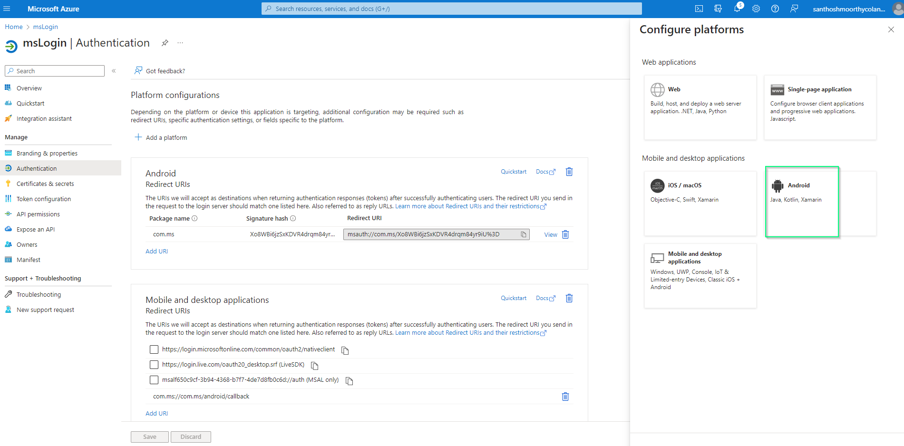
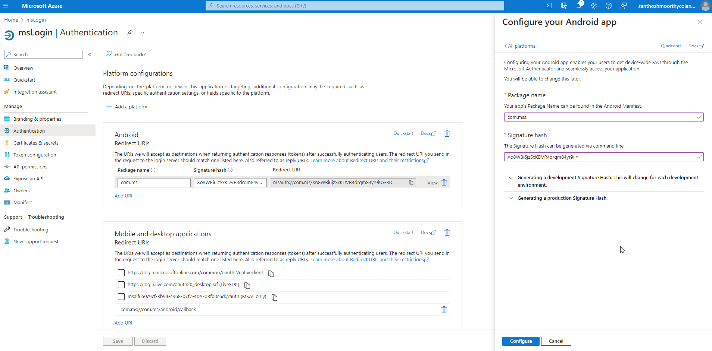
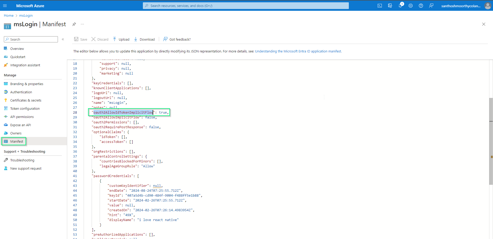
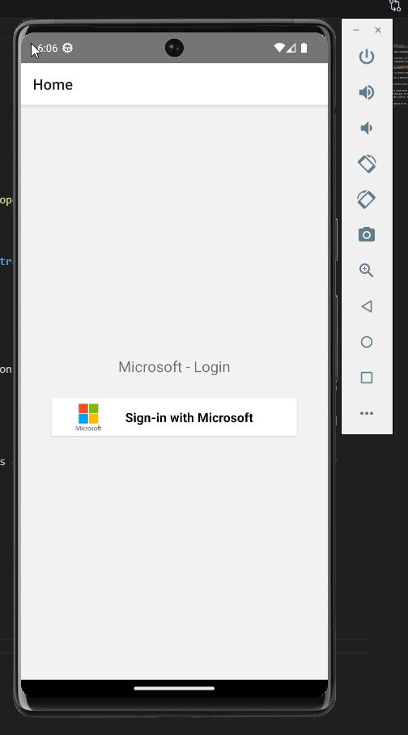

### Microsoft sign-in

# Prerequisites

```bash
npm i react-native-azure-auth --save
npm i @react-native-async-storage/async-storage --save
```

[**Refer**](https://www.npmjs.com/package/react-native-azure-auth)

**hash key generation**

To generate a development key hash, run the following command in a command prompt in the Java SDK folder:

[**Open ssl**] :(https://code.google.com/archive/p/openssl-for-windows/downloads)

```bash
keytool -exportcert -alias androiddebugkey -keystore "C:\Users\USERNAME\.android\debug.keystore" | "PATH_TO_OPENSSL_LIBRARY\bin\openssl" sha1 -binary | "PATH_TO_OPENSSL_LIBRARY\bin\openssl" base64
```

To allow the application to interact with the Microsoft server, it needs to be registered through [**Microsoft Application Registration Portal**](https://apps.dev.microsoft.com/#/appList).

Once the app is registered, an Application ID will be generated.



Go to the Certificates & Secrets section on the left and click New client secret, give your secret a name and click the Add button to get the secret key generated.



It will take two to three seconds before the secrete key will be shown on the screen.

Everything seems to be pretty good, but one more thing we have to tell Microsoft is which platform we are going to integrate this app on.

Go to Authentication > Add a platform > Android



fill package name and signature has key



**NOTE** : kindly change in manifest section ---------> oauth2AllowIdTokenImplicitFlow : true



Out put


